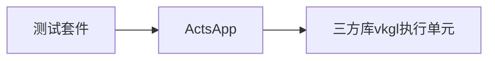
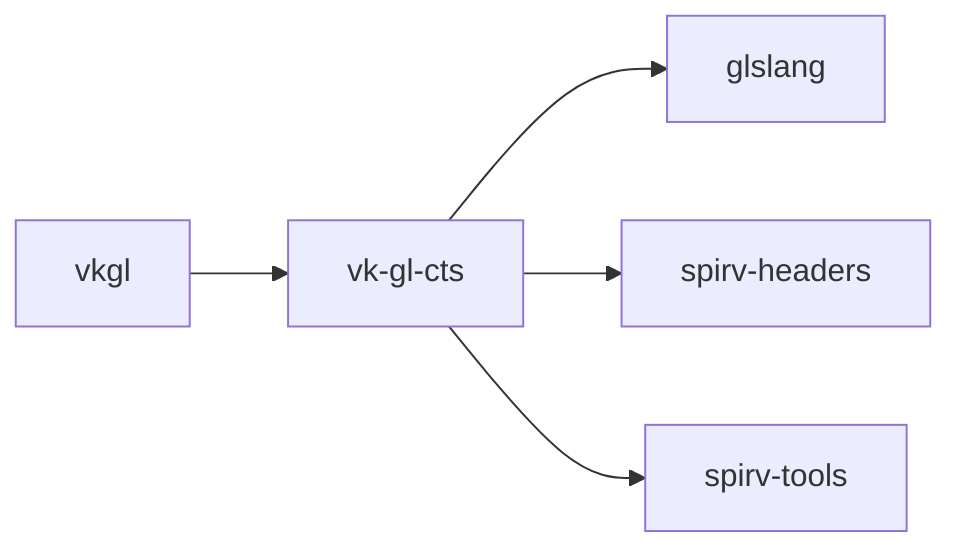

### vkgl 测试框架介绍

#### 概要说明

vkgl 是基于开源库VK-GL-CTS（版本：opengl-es-cts-3.2.8），进行移植开发的OpenHarmony的测试套件，目录结构如下：

```bash
.
├── BUILD.gn				//编译配置
├── comm.gni				//共同编译参数
├── cpvkgl.sh				//编译打包脚本，负责打包依赖so库和依赖测试数据
└── src
    ├── ActsApp.cpp			//测试项调用入口
    ├── ActsApp.h			
    ├── deqpgles2			//deqp gles2测试用例suite
    ├── deqpgles3			//deqp gles3测试用例suite
    ├── deqpgles31			//deqp gles31测试用例suite
    ├── khrgles2			//khr gles2测试用例suite
    ├── khrgles3			//khr gles3测试用例suite
    ├── khrgles31			//khr gles31测试用例suite
    ├── khrgles32			//khr gles32测试用例suite
    ├── khrglesext			//khr glesext测试用例suite
    ├── logdefine.h			//测试结果数据收集定义
    └── shrinkdefine.h		//测试框架简化定义
```

其中具体测试项目为：

* deqpgles2：对应vk-gl-cts库的 gles2.txt，路径为external/openglcts/data/mustpass,在此路径下有deqp和khr两种，在此我们选择deqp的case，共包括用例16492条，
* deqpgles3：对应vk-gl-cts库的 gles3.txt，路径为external/openglcts/data/mustpass,在此路径下有deqp和khr两种，在此我们选择deqp的case，共包括用例44389条，
* deqpgles31：对应vk-gl-cts库的 gles31.txt，路径为external/openglcts/data/mustpass,在此路径下有deqp和khr两种，在此我们选择deqp的case，共包括用例37854条，
* khrgles2：对应vk-gl-cts库的 gles2-khr.txt，路径为external/openglcts/data/mustpass,在此路径下有deqp和khr两种，在此我们选择khr的case，共包括用例472条，
* khrgles3：对应vk-gl-cts库的 gles3-khr.txt，路径为external/openglcts/data/mustpass,在此路径下有deqp和khr两种，在此我们选择khr的case，共包括用例4079条
* khrgles31：对应vk-gl-cts库的 gles31-khr.txt，路径为external/openglcts/data/mustpass,在此路径下有deqp和khr两种，在此我们选择khr的case，共包括用例3497条
* khrglesext：对应vk-gl-cts库的 glesext-khr.txt，路径为external/openglcts/data/mustpass,在此路径下有deqp和khr两种，在此我们选择khr的case，共包括用例335条

测试套件执行流程为：


#### 适配说明

* vkgl 测试依赖于三方库内的vk-gl-cts库，以及glslang，spirv-headers，spirv-tools三个库，对应关系如下：



* vk-gl-cts适配方式：在vk-gl-cts/framework/platform内增加OpenHarmony适配目录，适配目录内增加ohos适配层，针对rosen图形框架进行适配，实现对gpu驱动的加载和对应图形API的测试。

  ```bash
  vk-gl-cts/framework/platform
  ├── android
  ├── BUILD.gn
  ├── CMakeLists.txt
  ├── ios
  ├── lnx
  ├── null
  ├── nullws
  ├── ohos								//OpenHarmony适配目录
  │   ├── context
  │   ├── display
  │   ├── rosen_context
  │   ├── tcuOhosPlatform.cpp
  │   ├── tcuOhosPlatform.hpp
  ├── osx
  ├── raspi
  ├── surfaceless
  ├── tcuMain.cpp
  ├── vanilla
  └── win32
  ```


* vkgl测试套件的编译：

  * 在test/xts/acts/graphic/BUILD.gn里增加deps，如下：

    ```bash
    import("//build/ohos_var.gni")
    group("graphic") {
      testonly = true
      if (is_standard_system) {
        deps = [
          "webGL:webGL_hap_test",
          "windowstandard:window_hap_test",
          #增加下面内容------------------------------------------
          "vkgl:cpvkgl",				//vkgl测试套件入口包括vkgl测试，测试打包脚本
          #到此为止---------------------------------------------
        ]
      } else {
        deps = [
          "appaccount:appaccount_hap",
          "osaccount:osaccount_hap",
        ]
      }
    }
    ```


  * vkgl测试套件的编译命令（源码根目录执行）：

    ```bash
    ./build.sh --product-name rk3568 --gn-args build_xts=true --build-target "acts" --gn-args is_standard_system=true
    ```

#### 使用说明

* vkgl测试套件编译完成后生成的**测试套件**使用流程如下：

  * vkgl**测试套件**会输出测试程序至两个路径：

    1. out/rk3568/suites/acts/testcases/

       此路径下包括测试程序和vkgldata测试依赖库和测试数据包，具体如下：

       ```bash
       ├── libdeqp_ohos_platform.z.so
       ├── libdeqp_SPIRV.z.so
       ├── libdeqp_SPVRemapper.z.so
       ├── librosen_context.z.so
       └── vkgldata.tar.gz
       ```
       
    2. out/rk3568/common/common

       此路径下的测试程序为glcts，可以直接拷贝至设备上运行，运行命令如下：
       
       ```bash
       ./glcts --deqp-case=dEQP-GLES2.*
       ```
       
       --deqp-case=参数目前支持：dEQP-GLES2，dEQP-GLES3, dEQP-GLES31, KHR-GLES2, KHR-GLES3, KHR-GLES31, 号意思就是后面的全部，所以如果指定具体case就写完整路径
       
       --deqp-caselist-file=参数支持直接传txt文件进行测试

  * vkgl测试套件运行结束会生成qpa文件方便开发人员调试，qpa文件可以通过vk-gl-cts/scripts/log内的脚本进行解析，具体命令如下：

    ```bash
    python2 log_to_xml.py TestResults.qpa TestResults.xml
    ```
